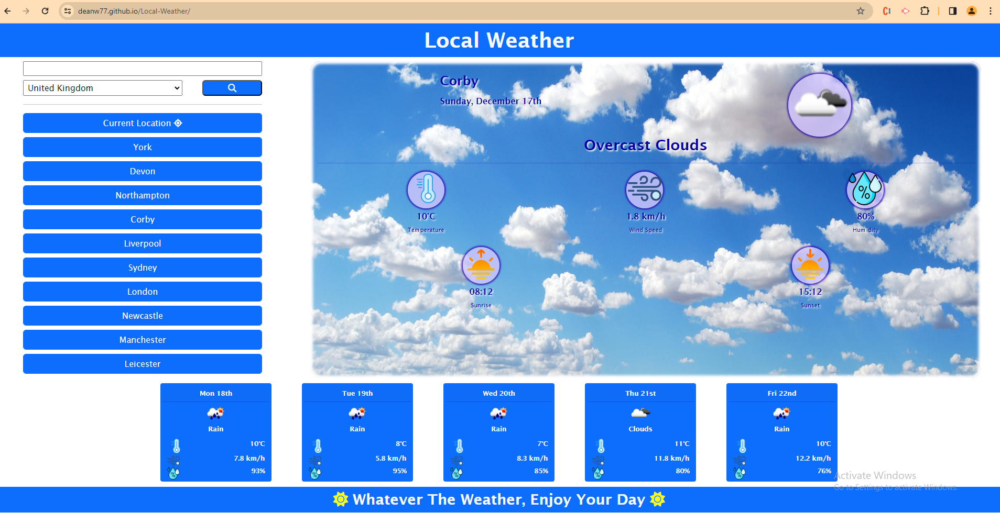

# Local-Weather

A weather app that fethces data from Open-Weather API and displays current weather and five-day forecast as well as search history.

## User Requirements

1) Needs to fetch weather from Open-Weather using jQuery fetch().
2) Needs to display current weather as well as five-day forcast.
3) Needs to be able to search for any city, any country.
4) Needs to use dayjs() to get date.
5) Needs to store search history in Local Storage.
6) Needs to display weather icons for current weather.

## Problems Solved

1) Added function to prevent empty buttons as well as duplicate buttons, that disregards capitalization. ie. 'Rothwell' & 'rothwell' would be seen as a duplicate.
2) Added a function that, in the event the city searched does not create valid data response, then an error message appears and no button is created and search value is not stored in Local Storage. This ensures all search history buttons create a weather report.
3) Added a function to limit the saved history to ten citys.
4) Decided to add a button that attempts to use Current Location if allowed by the browser. 
5) Also added Sunrise and Sunset details, using dayjs to parse the unix time and timezone offset to ensure it adjusts to time to the search cities local time.
6) Added a country dropdown menu that defaults to UK and uses a seperate countries.js file to store country data and populate dropdown list.
7) Built primarily with Bootstrap since I needed to improve my Bootstrap skills before first project.
8) Finally, I added a reverse geoloaction api call to add city name when current location is used. 

## Hosted Site

Here it is, check you local weather, plan your weeks activities.....  
https://deanw77.github.io/Local-Weather/

### Project Overview

Excellent project to tie together all the diiferent elements I have learnt, Bootstrap, jQuery, API's & dayjs all in one project. Enjoyed throwing in the extra challenge of making sure no duplicate buttons could be created and that only buttons that generated a valid response from the weather API would be stored and generated. 
I wanted to add the current location as I initially had no idea how that worked.
In order to make more use of dayjs I added the sunrise and sunset times, it took me a little while to figure out I needed to offset it by the local_time offset from Open Weather in order for it to be correct for all countries.
I did aim to make as much of the styling done with Bootstrap boot did want to use a little custom CSS to add background image and highlight my icons a little. Also learnt how to create a blurred edge with an inset border. 

### Final Result

#### Worth Noting:

The one bug that caused me hours of headaches and turned out to be a simple fix:
Search history buttons all worked up until a new button was added then none of them would work. Turned out I needed to bind the onClick to the parent container. 
$('#searchItems').on('click', '.historyButton', function (event)) {} 